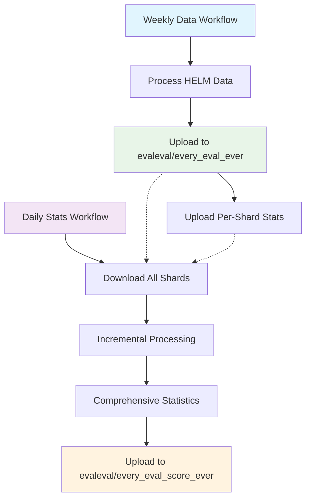

# Dual Workflow Architecture

## 🏗️ New Architecture Overview

The evaluation data processing pipeline is now split into **two independent workflows** for better modularity, reliability, and resource management.

## 📋 Workflow 1: Data Processing & Upload
**File**: `.github/workflows/scrape_and_upload.yml`

### Schedule
- **Weekly**: Monday 03:00 UTC
- **Manual**: `workflow_dispatch` trigger

### Purpose
- Scrape and process HELM evaluation data
- Upload detailed evaluation records to `evaleval/every_eval_ever`
- Upload per-shard statistics alongside detailed data

### Steps
1. Environment validation
2. HELM data processing (lite, mmlu, classic)
3. Upload detailed parquet files
4. Upload individual shard statistics

### Resources
- **Timeout**: 360 minutes (6 hours)
- **Focus**: Data collection and processing
- **Output**: Detailed evaluation data + per-shard stats

---

## 📊 Workflow 2: Comprehensive Statistics Generation
**File**: `.github/workflows/generate_comprehensive_stats.yml`

### Schedule
- **Daily**: 06:00 UTC (3 hours after data processing)
- **Manual**: `workflow_dispatch` with options:
  - `source_name`: Choose source (default: 'helm')
  - `force_regenerate`: Force regeneration

### Purpose
- Download all uploaded data shards incrementally
- Generate comprehensive cross-benchmark statistics
- Upload unified leaderboard to `evaleval/every_eval_score_ever`

### Steps
1. Incremental shard processing (memory-efficient)
2. Comprehensive statistics calculation
3. Upload to statistics dataset
4. Validation and reporting

### Resources
- **Timeout**: 120 minutes (2 hours)
- **Focus**: Statistics aggregation
- **Output**: Comprehensive leaderboard data

---

## 🎯 Benefits of Separation

### 1. **Decoupled Operations**
- Data upload failures don't affect statistics generation
- Statistics generation failures don't affect data uploads
- Each workflow can evolve independently

### 2. **Optimized Scheduling**
- **Data processing**: Weekly (matches HELM update frequency)
- **Statistics**: Daily (provides fresh leaderboards)
- **Stats run after data**: 3-hour buffer ensures data is available

### 3. **Resource Efficiency**
- **Data workflow**: Longer timeout for heavy processing
- **Stats workflow**: Shorter timeout for lighter aggregation
- **Independent scaling**: Each can use appropriate resources

### 4. **Flexibility**
- **Manual triggers**: Can run stats generation anytime
- **Source selection**: Stats workflow supports multiple sources
- **Force regeneration**: Option to rebuild stats from scratch

### 5. **Failure Resilience**
- If data upload fails → stats use existing data
- If stats fail → detailed data is still available
- Independent retry capabilities

---

## 📈 Data Flow



## 🔄 Timing Example

### Monday 03:00 UTC - Data Processing
```
03:00 - Start HELM data processing
04:30 - Upload lite benchmark data
05:00 - Upload mmlu benchmark data  
05:30 - Upload classic benchmark data
06:00 - Data workflow complete
```

### Monday 06:00 UTC - Statistics Generation
```
06:00 - Start comprehensive stats generation
06:05 - Download lite shard incrementally
06:10 - Download mmlu shard incrementally
06:15 - Download classic shard incrementally
06:20 - Generate comprehensive statistics
06:25 - Upload comprehensive stats
06:30 - Stats workflow complete
```

### Tuesday-Sunday 06:00 UTC
```
06:00 - Generate stats from existing data
06:05 - Quick incremental processing
06:10 - Upload updated comprehensive stats
06:15 - Complete (no new data to process)
```

## 🛠️ Manual Usage

### Trigger Data Processing
```yaml
# Use GitHub Actions UI or:
gh workflow run scrape_and_upload.yml
```

### Trigger Statistics Generation
```yaml
# Default (helm source)
gh workflow run generate_comprehensive_stats.yml

# Custom source
gh workflow run generate_comprehensive_stats.yml \
  -f source_name=eval_harness

# Force regeneration
gh workflow run generate_comprehensive_stats.yml \
  -f source_name=helm \
  -f force_regenerate=true
```

## 📊 Monitoring

### Data Workflow Success
- Check `evaleval/every_eval_ever` for new parquet files
- Files named: `helm_{benchmark}_part_{number}.parquet`

### Stats Workflow Success  
- Check `evaleval/every_eval_score_ever` for comprehensive stats
- Files named: `comprehensive_stats_{source}_{timestamp}.parquet`

### Both Workflows
- GitHub Actions logs provide detailed progress
- Failure notifications in workflow status
- Manual retry capability for both workflows

## 🎉 Result

✅ **Modular**: Independent workflows for different concerns  
✅ **Resilient**: Failure isolation between data and stats  
✅ **Flexible**: Different schedules and manual control  
✅ **Efficient**: Optimized resource usage for each task  
✅ **Scalable**: Easy to add new sources and statistics types
