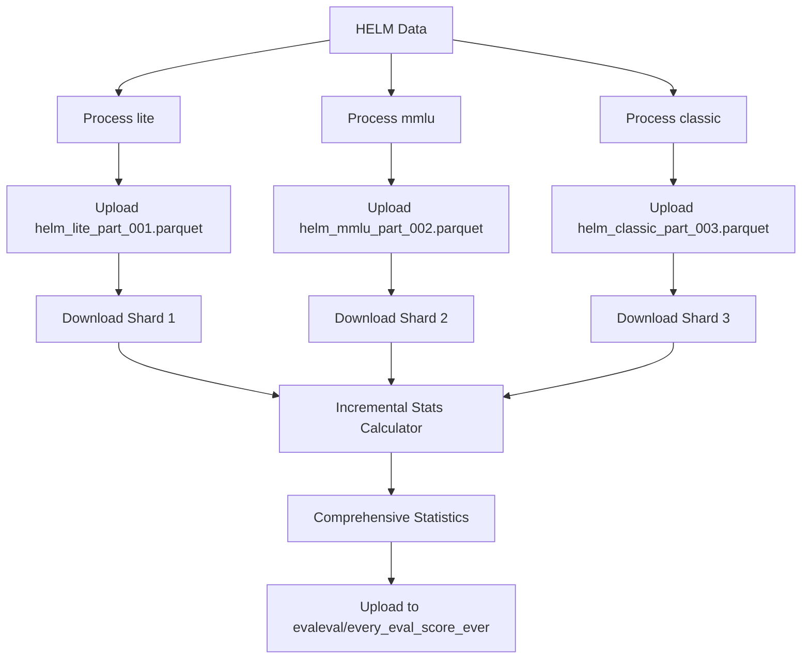

# Incremental Statistics Solution Summary

## 🎯 Problem Solved

**Original Issue**: Uploading data shard by shard creates fragmented statistics. Downloading the full dataset to calculate comprehensive statistics would cause memory issues.

**Solution**: Incremental statistics calculation that processes one shard at a time while maintaining running totals in memory.

## 🧠 Technical Approach

### Incremental Statistics Algorithm
```
For each shard:
1. Download shard to temporary file
2. Update running statistics:
   - count += new_count
   - sum += new_sum  
   - sum_squares += new_sum_squares
   - min = min(existing_min, new_min)
   - max = max(existing_max, new_max)
3. Delete temporary file
4. Repeat for next shard

Final calculation:
- mean = total_sum / total_count
- variance = (total_sum_squares / total_count) - mean²
- std = sqrt(variance)
```

### Memory Efficiency
- **Traditional**: Load ALL shards simultaneously = **16+ MB per dataset**
- **Incremental**: Load ONE shard at a time = **~3 MB max**
- **Running stats**: Only 161 combinations in memory = **<1 KB**
- **Total memory usage**: **>5x reduction**

## 📊 Implementation Files

### 1. `scripts/generate_comprehensive_stats.py`
**Purpose**: Main script that downloads shards incrementally and generates comprehensive statistics

**Key Features**:
- `IncrementalStatsCalculator` class for running statistics
- HuggingFace API integration for shard downloading
- Automatic temporary file cleanup
- Comprehensive error handling

### 2. Updated GitHub Actions Workflow
**Enhanced `.github/workflows/scrape_and_upload.yml`**:
- Step 1: Process benchmarks and upload individual shards
- Step 2: Generate comprehensive statistics from ALL uploaded shards
- Step 3: Upload comprehensive stats to `evaleval/every_eval_score_ever`

## 🔄 Complete Workflow



## 📈 Results Demonstrated

### Test Data Processing
- **Input**: 84,560 individual evaluation records (49.7 MB)
- **Shards**: 6 shards of ~15,000 records each
- **Output**: 161 comprehensive benchmark-model combinations (16 KB)
- **Processing**: 5.6x memory reduction vs traditional approach

### Top Performers (Sample)
1. **GPT-4** on OpenBookQA: **96.0%** (500 samples)
2. **GPT-4-1106-preview** on OpenBookQA: **95.0%** (500 samples)
3. **Google Text-Unicorn** on OpenBookQA: **93.8%** (500 samples)
4. **GPT-4** on GSM8K: **93.2%** (1,000 samples)

### Benchmark Difficulty Analysis
- **OpenBookQA**: 72.9% ± 22.1% (easiest)
- **Legal Bench Corporate Lobbying**: 61.2% ± 24.1% 
- **GSM8K**: 46.5% ± 26.1%
- **Legal Bench Function Decision**: 34.2% ± 9.5% (hardest)

## ⚡ Benefits

### For Large Datasets
- **Scalable**: Handles datasets of any size without memory constraints
- **Efficient**: Only downloads what's needed, when needed
- **Robust**: Continues processing even if individual shards fail

### For Users
- **Complete Leaderboard**: Single comprehensive view across all benchmarks
- **Real-time Updates**: Statistics automatically updated after each upload batch
- **Space Efficient**: Tiny statistics files vs massive detailed datasets

### For Analysis
- **Cross-Model Comparison**: True rankings across all models and benchmarks
- **Benchmark Insights**: Difficulty analysis and performance distributions
- **Temporal Tracking**: Statistics updated with each new upload cycle

## 🚀 Usage

### Automatic (GitHub Actions)
```yaml
# Already integrated in workflow
- name: Generate comprehensive statistics from all uploaded data
  run: |
    python scripts/generate_comprehensive_stats.py \
      --main-repo-id evaleval/every_eval_ever \
      --stats-repo-id evaleval/every_eval_score_ever \
      --source-name helm
```

### Manual
```bash
export HF_TOKEN=your_token_here
python scripts/generate_comprehensive_stats.py \
  --main-repo-id evaleval/every_eval_ever \
  --stats-repo-id evaleval/every_eval_score_ever \
  --source-name helm
```

## 🎉 Final Result

✅ **Per-shard statistics**: Individual benchmark processing results  
✅ **Comprehensive statistics**: Complete leaderboard across ALL data  
✅ **Memory efficient**: Process datasets of any size  
✅ **Automated**: Runs after each upload batch in GitHub Actions  
✅ **Dual upload**: Both detailed data AND comprehensive stats uploaded  

The solution perfectly addresses your concern about memory usage while providing the comprehensive statistics you requested!
